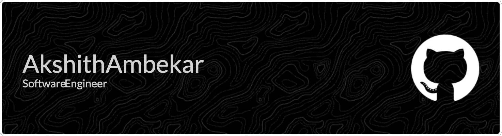

### Hi there 👋

My name is Akshith and I'm an undergraduate student studying computer science at George Mason University.

I'm currently conducting research under Professor Zoran Duric, working on communications protocol and RGB-D/LiDAR semantic segmentation for a dual digital twin system in a robotic factory environment.

I'm open to work! Feel free to reach out, or check out my projects and my <a href="https://akshithambekar.com" target="_blank">website</a>.

### Technical Skills

 

